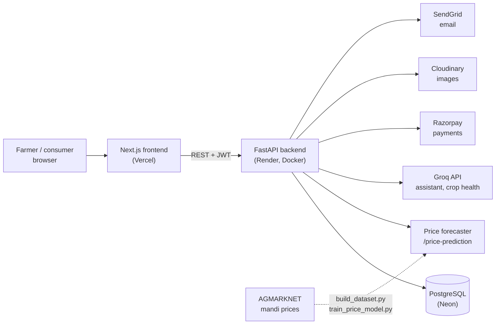

# 🌾 KisaanConnect

**A farmer-to-consumer marketplace for India, with a mandi price forecaster and AI farming tools.**

Farmers list produce and sell directly to consumers, see a one-week-ahead price forecast built from
real AGMARKNET mandi prices, and get help from an AI assistant. Consumers buy fresh produce, adopt a
farm plot for a season, or donate to farmer-support NGOs.

**Live app:** https://kisaan-connect-kappa.vercel.app
**API docs:** https://kisaanconnect-jabb.onrender.com/docs
(The backend runs on a free plan that sleeps when idle, so the first request can take about a minute.)

Final-year B.Tech CSE team project, BIGCE Solapur.

---

## Contents
- [Features](#features)
- [Tech stack](#tech-stack)
- [Architecture](#architecture)
- [Price forecaster: model card](#price-forecaster-model-card)
- [Run it locally](#run-it-locally)
- [Retrain and evaluate the model](#retrain-and-evaluate-the-model)
- [Deployment](#deployment)
- [API overview](#api-overview)
- [Project structure](#project-structure)
- [Security](#security)
- [Data sources and licences](#data-sources-and-licences)
- [Team](#team)

---

## Features

**For farmers**
- Add, edit and bulk-upload crop listings (CSV), with image upload
- Sales dashboard with charts, low-stock alerts and order management
- **Price forecaster**: pick state, crop and variety to get next week's expected mandi price, a typical range and last week's price
- AI farming assistant (English, Hindi, Marathi), AI crop health check from a photo, and an AI listing-description writer
- Offer farm plots for adoption and post progress updates to adopters

**For consumers**
- Browse the marketplace, wishlist, cart and checkout with Razorpay
- Order history with one-click repeat order
- Ratings and reviews (only from verified buyers)
- Adopt a farm plot for a season; donate to partner NGOs

**Other**
- Admin panel for users, crops and orders
- Newsletter sign-up, referrals, and a homepage ticker of forecast mandi rates

## Tech stack

| Layer | Technology |
|---|---|
| Frontend | Next.js 16, React 19, Tailwind CSS, Recharts |
| Backend | FastAPI (Python 3.12), Uvicorn, Docker |
| Database | PostgreSQL (Neon) |
| Price model | scikit-learn `HistGradientBoostingRegressor`, pandas |
| AI | Groq API (LLaMA text and vision models) |
| Payments | Razorpay |
| Images / email | Cloudinary / SendGrid |
| Auth | JWT (PyJWT), PBKDF2-HMAC-SHA256 password hashing |
| Hosting | Vercel (frontend), Render (backend) |

## Architecture



The price forecaster is a FastAPI sub-app mounted at `/price-prediction`. It loads a small model file
(about 250 KB) and a JSON file of recent state-level prices at startup, so it needs no database.

## Price forecaster: model card

**What it does.** Forecasts the modal price (Rs per quintal, shown per kg) that mandis in a state will
report for a crop and variety, one week after the latest data. It returns the forecast, a typical
range, last week's price and a confidence level. Inputs the data doesn't cover get a clear error
instead of a guess.

**How it works.** A gradient-boosting model predicts how much the price will move from the most
recent known price. Its inputs are the mandi's and the state's median price a week earlier and a month
earlier, the number of days with reports, the month, the state and the crop. Every input is at least
7 days older than the date being forecast.

**Data.** 1.57 million cleaned AGMARKNET mandi reports: Aug 2024 to Aug 2025 (8 states) and
21 Jul to 24 Sep 2026 (30 states, including Maharashtra). See [data sources](#data-sources-and-licences).

**Evaluation.** Time-based: train on earlier dates, test on later dates, every method forecasting one
week ahead. Average error in Rs/kg (lower is better):

| Test set | Last month's price | Last week's price | Previous model (average per crop) | Forecaster |
|---|---|---|---|---|
| May to Aug 2025 (8 states) | 5.98 | 3.61 | 9.17 | **3.55** |
| 11 to 24 Sep 2026 (30 states) | 9.72 | 5.47 | 11.61 | **5.42** |
| Maharashtra, 11 to 24 Sep 2026 | 8.91 | **5.09** | 9.97 | 5.21 |

- Using recent prices cuts the error by about half compared with the previous model, which predicted one fixed average per crop.
- The forecaster is only 1 to 2% better than simply repeating last week's price, and slightly worse in Maharashtra over the two test weeks. Short-term mandi prices are hard to beat with history alone.
- In the app, half of actual mandi prices fell within about -12% to +17% of the forecast (measured 11 to 24 Sep 2026). This is the range shown as Low and High.

Full results by crop and by mandi: [`evaluation/REPORT.md`](KisaanConnect/backend/price_prediction/evaluation/REPORT.md).

**Limits.**
- Forecasts are for the week after the latest data (currently 24 Sep 2026). Until the data is refreshed, they get older.
- The 2026 test window is only two weeks, and there's no data between Aug 2025 and Jul 2026.
- It uses only past prices: no weather, arrivals, festivals or policy changes.
- It's a guide, not advice. Farmers should check today's local mandi rate before selling.

## Run it locally

You need **Python 3.12** (same as the Docker image; the pinned pandas 2.2.3 has no Python 3.14 build),
**Node.js 20+**, a free PostgreSQL database (e.g. [Neon](https://neon.tech)) and, for the AI
features, a free [Groq API key](https://console.groq.com).

Commands below are for Windows PowerShell; on Mac/Linux use `source venv/bin/activate` and `cp`.

**1. Clone**
```powershell
git clone https://github.com/pradnyajadhav15/KisaanConnect.git
cd KisaanConnect\KisaanConnect
```

**2. Database.** Open your database's SQL editor (in Neon: **SQL Editor**), paste the contents of
[`backend/setup_database.sql`](KisaanConnect/backend/setup_database.sql) and run it. It creates all
tables and the partner NGOs.

**3. Backend**
```powershell
cd backend
py -3.12 -m venv venv
venv\Scripts\activate
pip install -r requirements.txt
Copy-Item .env.example .env      # then fill in the values
uvicorn main:app --reload --port 8000
```
API: http://localhost:8000, docs: http://localhost:8000/docs

**4. Frontend** (in a second terminal)
```powershell
cd frontend
Copy-Item .env.example .env.local
npm install
npm run dev
```
App: http://localhost:3000

### Environment variables

`backend/.env` (see [`backend/.env.example`](KisaanConnect/backend/.env.example)). Never commit it.

| Variable | Needed for |
|---|---|
| `DATABASE_URL` | Everything (PostgreSQL connection string) |
| `JWT_SECRET` | Login. The backend won't start without it |
| `ALLOWED_ORIGINS` | Comma-separated frontend URLs allowed to call the API |
| `GROQ_API_KEY` | AI assistant, crop health, descriptions |
| `RAZORPAY_KEY_ID`, `RAZORPAY_KEY_SECRET` | Payments, farm adoption, donations |
| `CLOUDINARY_CLOUD_NAME`, `CLOUDINARY_API_KEY`, `CLOUDINARY_API_SECRET` | Image upload |
| `SENDGRID_API_KEY`, `SENDER_EMAIL` | Emails |

`frontend/.env.local`: `NEXT_PUBLIC_API_URL=http://localhost:8000`

## Retrain and evaluate the model

From `KisaanConnect/backend`, with the venv active:

```powershell
python -m price_prediction.data.build_dataset --download   # rebuild data (downloads the 2026 snapshot)
python train_price_model.py                                 # train, writes models/*.joblib + model_meta.json
python -m price_prediction.evaluation.evaluate              # refresh evaluation/REPORT.md
```

The 2024-25 Kaggle file must be downloaded by hand into `price_prediction/data/raw/`
(see [`SOURCES.md`](KisaanConnect/backend/price_prediction/data/SOURCES.md)). Without it the
build still works, using the 2026 data only. Training fails on purpose if Maharashtra has fewer than
20 crops with enough reports.

## Deployment

| Part | Where | Settings |
|---|---|---|
| Frontend | Vercel | Root directory `KisaanConnect/frontend`; env `NEXT_PUBLIC_API_URL` = backend URL (no trailing `/`) |
| Backend | Render (free web service, Docker) | Root directory `KisaanConnect/backend`; all backend env vars; `ALLOWED_ORIGINS` includes the Vercel URL |
| Database | Neon (free) | Run `backend/setup_database.sql` once |

Both Vercel and Render redeploy automatically on every push to `main`. `NEXT_PUBLIC_API_URL` is
read at build time, so redeploy the frontend after changing it.

## API overview

| Method | Endpoint | Purpose |
|---|---|---|
| POST | `/auth/register`, `/auth/login/user` | Create account, log in (JWT) |
| GET/POST | `/farmer/mine`, `/farmer/`, `/farmer/bulk-upload` | Farmer's crops, add crop, CSV upload |
| GET | `/farmer/dashboard/stats`, `/farmer/sales-summary` | Farmer dashboard |
| GET | `/consumer/marketplace` | Browse crops |
| POST/GET | `/consumer/cart`, `/consumer/orders`, `/consumer/orders/mine` | Cart and orders |
| POST | `/payment/create-order`, `/payment/verify` | Razorpay checkout |
| GET/POST | `/adopt-farm/plots`, `/adopt-farm/adopt` | Adopt a farm |
| GET/POST | `/ngo/ngos`, `/ngo/donate` | NGOs and donations |
| POST | `/ai/ask`, `/ai/describe`, `/ai/crop-health` | AI assistant, descriptions, crop photo check |
| GET | `/price-prediction/options?state=`, `/price-prediction/varieties?commodity=&state=` | Supported states, crops, varieties |
| POST | `/price-prediction/predict` | Price forecast, e.g. `{"state": "Maharashtra", "commodity": "Onion"}` |

Full interactive docs: `/docs` on the backend.

## Project structure

```
KisaanConnect/
├── frontend/                  Next.js app (app/, components/, lib/)
└── backend/
    ├── main.py                FastAPI app, mounts all routers
    ├── auth/ farmer/ consumer/ admin/ ai/
    ├── payment.py adopt_farm.py ngo.py reviews.py wishlist.py ...
    ├── setup_database.sql     one-time database setup
    └── price_prediction/
        ├── data/              build_dataset.py, mandi_history.csv.gz, SOURCES.md
        ├── features.py        recent-price features (no look-ahead)
        ├── models/            forecaster.py, train_model.py, model files
        ├── evaluation/        evaluate.py, REPORT.md, per-crop/per-mandi CSVs
        └── api/               prediction_api.py (/price-prediction)
```

## Security

- Passwords are hashed with PBKDF2-HMAC-SHA256 and a per-user salt, and compared in constant time.
- Login uses JWTs. The user's role and ID come from the verified token, never from the client.
- Farmers can only change their own crops and plots; consumers only see their own orders.
- Razorpay payments are verified on the server by signature before an order is confirmed.
- Secrets live only in `backend/.env` and the hosting dashboards, never in frontend code.

## Data sources and licences

- **AGMARKNET** (Directorate of Marketing & Inspection, Government of India), via:
  - [herrrickshaw/agri-commodity-tracker](https://github.com/herrrickshaw/agri-commodity-tracker): daily pulls, Jul to Sep 2026
  - Kaggle, *Agmarknet India Commodity Prices (Oct'24 to Aug'25)* by Anish, [CC BY-SA 4.0](https://creativecommons.org/licenses/by-sa/4.0/)
  - data.gov.in, single-day pull of 19 May 2025
- The cleaned dataset `mandi_history.csv.gz` includes the Kaggle data, so it is shared under **CC BY-SA 4.0**. Details: [`SOURCES.md`](KisaanConnect/backend/price_prediction/data/SOURCES.md).
- The NGOs in `setup_database.sql` are sample data for the demo.

## Team

Pradnya Jadhav, Sakshi Gangurde, Pooja Shinde, Shantanu Sawant, Vaishnavi Patil
Guide: Prof. C. M. Jadhav, BIGCE Solapur

Educational project.
